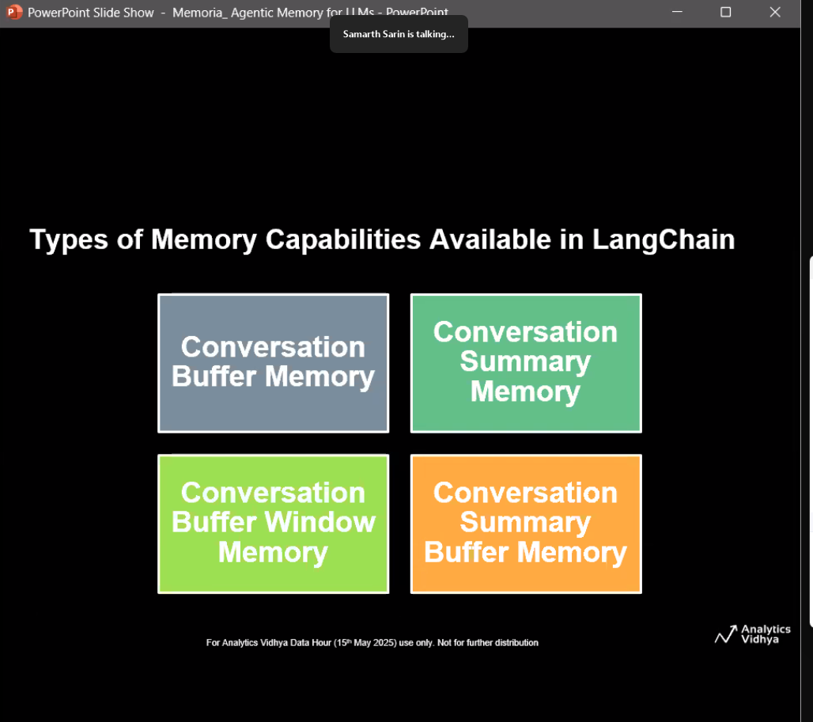

Just some notes on next steps - \
  Import Langchain and leverage langchain functionality
  Import SONAR
  Pre-processing of files eg run OCR tool on scanned PDF \
  Can i convert images and videos to text since Sonar API can only handle text. For videos, I can probably generate audio transcripts (ask Bes etc about this) \
  Chunking and embedding - maybe use recursive textsplitter and sentence piece \
  I can include sparse word entries in the Pinecone DB \
  Tagging DB entries with Metadata
  Use temperature setting to increase factuality of response for FAQs but perhaps relax this for report generation \
  Very quickly decide on Evals for the Agent(s) - I can use RAGAS for this
  Need to decide with Fari, what the role of Web search should be!!! 

  Graph RAG\
  Multi-agent - Orchestrator, FAQ Agent, Report Agent, Review/Feedback Agent \
  What Tools would I give them access to eg web etc. MCP/A2A \
  PII screens \
  System prompts \
  Agentic Memory \
  Stan mentioned DSPy could save me time

  LlamaIndex - what does this do? does this allow me achieve memory?
  Do i go for persistent memory, single-conversation memory (memory refreshed once session is refreshed) or no memory
  Doclng/Contextual AI (Douwe Kiela) for parsing documents including images

  Memoria - for memory

  Sonar API guide - https://docs.perplexity.ai/api-reference/chat-completions

  Responsible AI Guardrails eg NVIDIA, Nemo Guardrails, LLaMA Guard, Patronus, Cleanlab, Colang \
  Prompt Injection
  Jailbreaks
  PII leak
  Content Moderation

  Have an Op Risk Framework for the AI Agent eg library dependencies